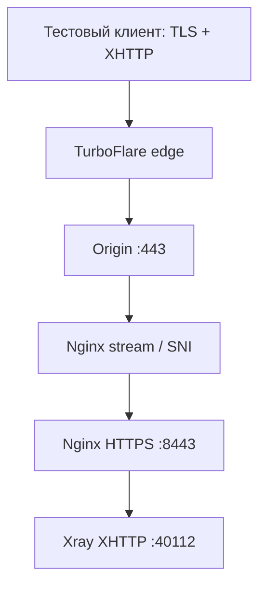
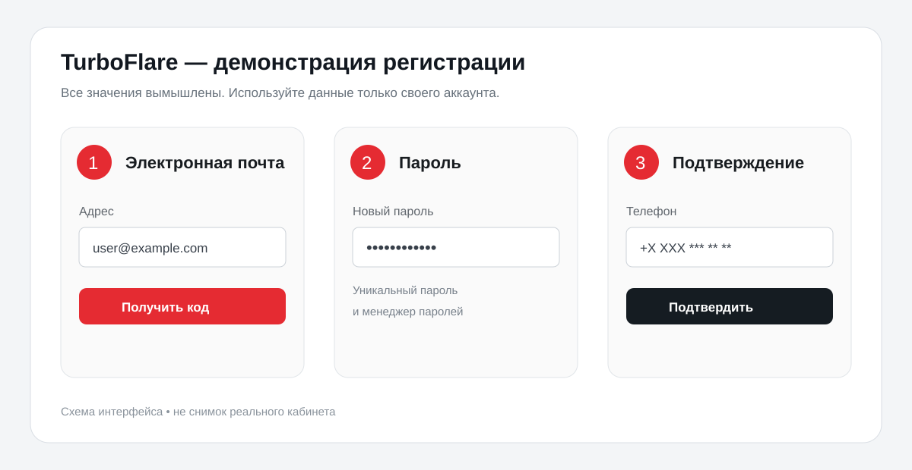
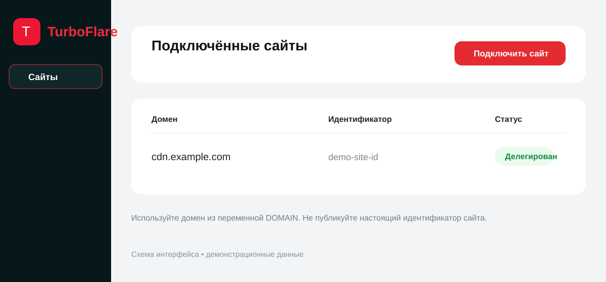
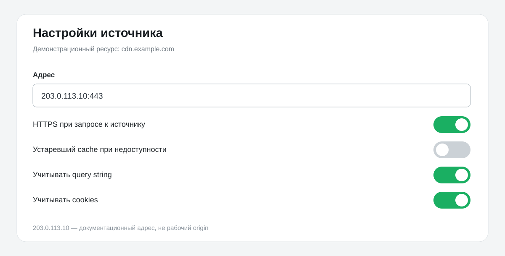
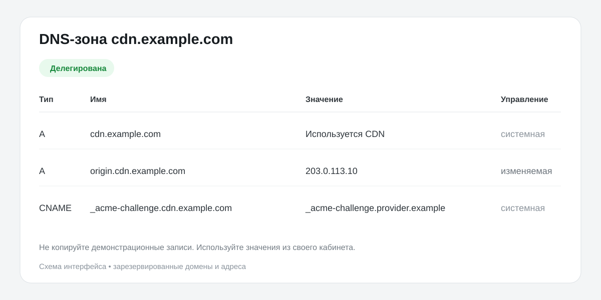
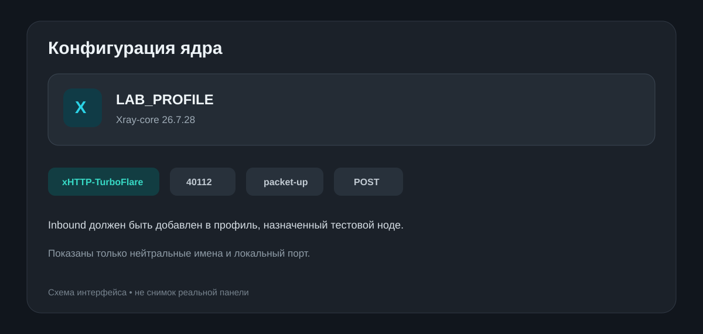
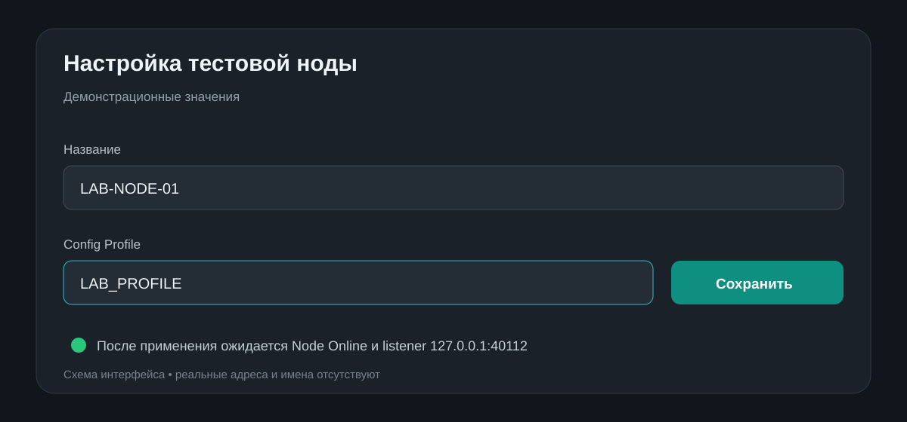
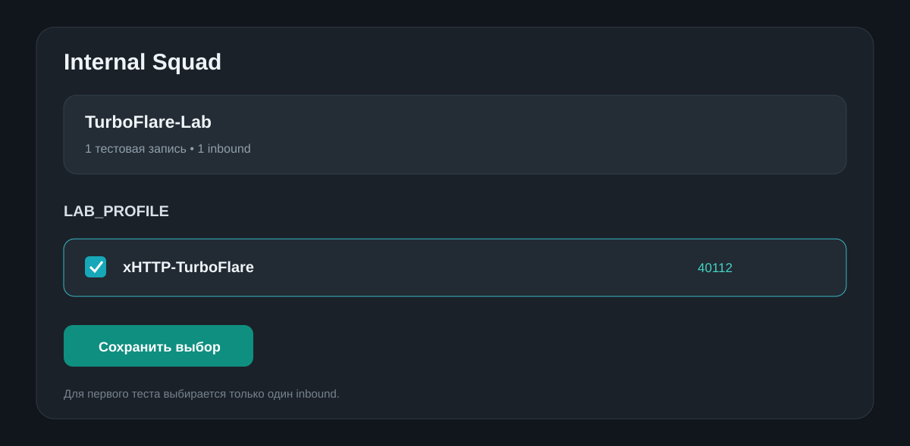
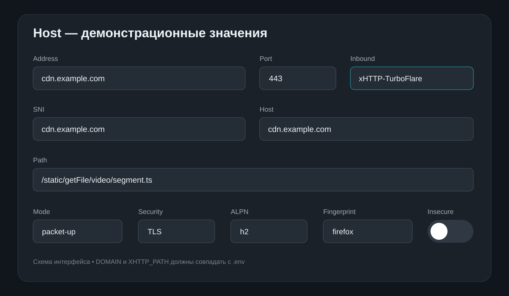

# TurboFlare CDN + Nginx + XHTTP: учебный стенд

Пошаговая инструкция по сборке лабораторного стенда с TurboFlare CDN, Nginx, Remnawave Node и Xray XHTTP `packet-up`.

> [!IMPORTANT]
> Материал предназначен только для обучения, тестирования и администрирования собственной либо явно авторизованной инфраструктуры. Соблюдайте применимое законодательство, условия TurboFlare и правила других задействованных сервисов.

В репозитории используются только демонстрационные значения:

- домен `cdn.example.com`;
- адрес origin `203.0.113.10` из документационного диапазона RFC 5737;
- нейтральные названия профилей и узлов;
- самостоятельно нарисованные схемы интерфейса без данных реальных аккаунтов.

Реальные домены, IP-адреса, UUID, электронные адреса, телефоны, ключи и сертификаты в репозиторий добавлять нельзя.

## Совместимость

- Проверенная версия: **Xray-core 26.7.28** на ноде и в клиентском приложении.
- Рабочая для TurboFlare схема: **POST + body + session/sequence в query**.
- Варианты `GET + body` в этом стенде не используются: при практической проверке TurboFlare не передавал их до origin в требуемом виде.
- Nginx проксирует XHTTP endpoint без request/response buffering и без cache.

## Архитектура



| Уровень | Назначение |
|---|---|
| TurboFlare | публичный TLS, DNS и доставка запросов до origin |
| Nginx stream | выбор локального backend по SNI |
| Nginx HTTPS | TLS для соединения CDN → origin, заглушка и proxy на XHTTP |
| Xray inbound | серверная обработка `packet-up` |
| Remnawave Host Extra | клиентские XMUX, размер POST и интервал отправки |

## Быстрый запуск

```bash
git clone https://github.com/indie-master/Turboflare_CDN_Setup_Guide.git
cd Turboflare_CDN_Setup_Guide

cp .env.example .env
nano .env

chmod +x install.sh scripts/render.sh
sudo bash install.sh
```

Если установщик сообщает, что отсутствует stream include, добавьте внутрь существующего блока `map $ssl_preread_server_name $backend`:

```nginx
include /etc/nginx/stream-map.d/*.map;
```

После этого снова запустите `sudo bash install.sh`.

Установщик создаёт:

```text
build/<DOMAIN>/xray-inbound.json
build/<DOMAIN>/remnawave-xhttp-extra.json
build/<DOMAIN>/remnawave-host-values.md
```

Краткая последовательность приведена в [QUICKSTART.md](QUICKSTART.md).

## Требования

- отдельная доменная зона, которую можно делегировать TurboFlare;
- origin-сервер с публичным IPv4;
- Debian или Ubuntu;
- Nginx с модулем stream;
- установленная Remnawave Panel и Remnawave Node;
- Xray-core `26.7.28`;
- тестовый клиент с поддержкой актуального XHTTP.

## Переменные

```bash
cp .env.example .env
nano .env
```

Минимально замените:

```dotenv
DOMAIN=cdn.example.com
ORIGIN_IP=203.0.113.10
ORIGIN_PORT=443

NGINX_INTERNAL_PORT=8443
XRAY_LISTEN_IP=127.0.0.1
XRAY_XHTTP_PORT=40112
XRAY_INBOUND_TAG=xHTTP-TurboFlare
XHTTP_PATH=/static/getFile/video/segment.ts
```

`cdn.example.com` и `203.0.113.10` являются только примерами. Файл `.env` исключён через `.gitignore`.

Для генерации без установки:

```bash
./scripts/render.sh
```

## Регистрация и настройка TurboFlare

Интерфейс может меняться, но последовательность остаётся прежней.

### 1. Учётная запись

1. Откройте официальный сайт TurboFlare.
2. Укажите собственный электронный адрес.
3. Подтвердите адрес кодом из письма.
4. Создайте уникальный пароль.
5. Если запрошен телефон, подтвердите его в интерфейсе провайдера.



Не публикуйте коды подтверждения, адрес, телефон или идентификатор учётной записи.

### 2. Подключение зоны

В разделе «Сайты» выберите «Подключить новый сайт» и укажите значение `DOMAIN`.



TurboFlare покажет набор NS-серверов. У регистратора замените текущие NS на значения из своего кабинета.

```bash
dig +short NS "$DOMAIN"
```

Дождитесь статуса «Делегирована» или «Переведен».

### 3. Источник

| Параметр | Значение |
|---|---|
| Адрес источника | `<ORIGIN_IP>:443` |
| HTTPS при запросе к источнику | включено |
| Устаревший cache при недоступности | выключено |
| Учитывать query string | включено |
| Учитывать cookies | включено |



### 4. DNS

Системные корневые записи и `_acme-challenge` могут быть заблокированы для удаления. Это нормальное поведение управляемой зоны.



```bash
dig +short NS "$DOMAIN"
dig +short A "$DOMAIN"
```

Публичная A-запись должна возвращать edge-адрес TurboFlare, а не origin.

## Origin TLS

В этой архитектуре допустим отдельный self-signed сертификат для соединения TurboFlare → origin. Публичный клиент получает сертификат edge.

`install.sh` создаёт:

```text
/etc/nginx/ssl/<DOMAIN>/origin.crt
/etc/nginx/ssl/<DOMAIN>/origin.key
```

Ручной эквивалент:

```bash
sudo install -d -m 700 /etc/nginx/ssl/cdn.example.com

sudo openssl req -x509 -nodes -newkey rsa:3072 -sha256 -days 3650 \
  -keyout /etc/nginx/ssl/cdn.example.com/origin.key \
  -out /etc/nginx/ssl/cdn.example.com/origin.crt \
  -subj "/CN=cdn.example.com" \
  -addext "subjectAltName=DNS:cdn.example.com,DNS:*.cdn.example.com" \
  -addext "basicConstraints=critical,CA:FALSE" \
  -addext "keyUsage=critical,digitalSignature,keyEncipherment" \
  -addext "extendedKeyUsage=serverAuth"

sudo chmod 600 /etc/nginx/ssl/cdn.example.com/origin.key
```

```bash
openssl x509 -in /etc/nginx/ssl/cdn.example.com/origin.crt \
  -noout -subject -issuer -dates -ext subjectAltName
```

## Nginx

### Stream/SNI router

Не создавайте второй публичный `listen 443`, если порт уже обслуживается существующим stream server:

```nginx
map $ssl_preread_server_name $backend {
    include /etc/nginx/stream-map.d/*.map;
    default 127.0.0.1:8443;
}

server {
    listen 443 reuseport;
    proxy_pass $backend;
    ssl_preread on;
    proxy_protocol on;
    proxy_socket_keepalive on;
}
```

Установщик создаст map-запись:

```nginx
cdn.example.com 127.0.0.1:8443;
```

Полный пример: [examples/nginx-stream-block.conf](examples/nginx-stream-block.conf).

### HTTPS vhost

Шаблон [templates/nginx-site.conf.template](templates/nginx-site.conf.template):

- слушает `127.0.0.1:8443`;
- принимает PROXY protocol от stream;
- завершает origin TLS;
- отправляет только `XHTTP_PATH` на `127.0.0.1:40112`;
- отключает buffering и cache;
- отдаёт нейтральную статическую страницу на остальных URL.

```bash
sudo nginx -t
sudo systemctl reload nginx
ss -lntp | grep -E ':443|:8443|:40112'
```

## Xray Config Profile

Выберите Xray-core `26.7.28` и добавьте в Config Profile объект из:

```text
build/<DOMAIN>/xray-inbound.json
```



Полный шаблон: [templates/xray-inbound.json.template](templates/xray-inbound.json.template).

Критичные серверные параметры:

```json
{
  "host": "cdn.example.com",
  "mode": "packet-up",
  "path": "/static/getFile/video/segment.ts",
  "extra": {
    "xmux": {
      "maxConcurrency": "1"
    },
    "seqKey": "chunk_id",
    "noSSEHeader": true,
    "noGRPCHeader": true,
    "seqPlacement": "query",
    "sessionIDKey": "auth",
    "xPaddingBytes": "50-150",
    "xPaddingMethod": "tokenish",
    "sessionIDLength": "16-32",
    "xPaddingObfsMode": true,
    "xPaddingPlacement": "header",
    "scMaxBufferedPosts": 100,
    "scMaxEachPostBytes": "3000000",
    "sessionIDPlacement": "query",
    "scMinPostsIntervalMs": "5-10",
    "serverMaxHeaderBytes": 32768
  }
}
```

Этот inbound сохраняет проверенную серверную схему без перехода на GET. Поля session и sequence должны совпадать с Remnawave Host Extra.

Для передачи адреса через локальный reverse proxy:

```json
"sockopt": {
  "trustedXForwardedFor": [
    "X-Real-IP",
    "X-Forwarded-For"
  ]
}
```

После назначения профиля ноде:

```bash
ss -lntp | grep ':40112'

cd /opt/remnanode
docker compose logs --since=15m remnanode \
  | grep -aEi 'xHTTP-TurboFlare|40112|error|failed'
```



## Internal Squad

1. Создайте `TurboFlare-Lab`.
2. Выберите Config Profile с новым inbound.
3. Отметьте только `xHTTP-TurboFlare`.
4. Добавьте одну тестовую запись.
5. Расширяйте выбор только после завершения проверки.



## Remnawave Host

### Основные поля

| Поле | Значение |
|---|---|
| Remark | `TurboFlare Lab` |
| Config Profile | профиль с новым inbound |
| Inbound | `xHTTP-TurboFlare` |
| Address | `DOMAIN` |
| Port | `443` |

### Расширенные поля

| Поле | Значение |
|---|---|
| SNI | `DOMAIN` |
| Host | `DOMAIN` |
| Path | `XHTTP_PATH` |
| Security Layer | `TLS` |
| ALPN | `h2` |
| Fingerprint | `firefox` |
| Allow insecure | `OFF` |
| Flow | пусто |
| Mode | `packet-up` |



### Клиентский XHTTP Extra

Вставьте содержимое `build/<DOMAIN>/remnawave-xhttp-extra.json`:

```json
{
  "xmux": {
    "maxConcurrency": "4-8",
    "hKeepAlivePeriod": 0,
    "hMaxRequestTimes": "600-900",
    "hMaxReusableSecs": "120-180"
  },
  "seqKey": "chunk_id",
  "noSSEHeader": true,
  "noGRPCHeader": true,
  "seqPlacement": "query",
  "sessionIDKey": "auth",
  "xPaddingBytes": "50-150",
  "xPaddingMethod": "tokenish",
  "sessionIDLength": "16-32",
  "xPaddingObfsMode": true,
  "xPaddingPlacement": "header",
  "scMaxEachPostBytes": "256000-512000",
  "sessionIDPlacement": "query",
  "scMinPostsIntervalMs": "30-50"
}
```

## Почему inbound и Host Extra различаются

| Параметр | Inbound ноды | Host Extra | Причина |
|---|---:|---:|---|
| HTTP method | POST по умолчанию | POST по умолчанию | совместимость с TurboFlare |
| `maxConcurrency` | `1` в проверенном baseline | `4-8` | меньше отдельных H2/TLS transports на клиенте |
| `scMaxEachPostBytes` | до `3000000` | `256000-512000` | сервер принимает больше, клиент отправляет меньшими блоками |
| `scMinPostsIntervalMs` | `5-10` в baseline | `30-50` | клиент отправляет менее агрессивно |
| `scMaxBufferedPosts` | `100` | не задаётся | серверный буфер переупорядочивания |
| `serverMaxHeaderBytes` | `32768` | не задаётся | лимит HTTP-заголовков origin |
| session/sequence | query | query | значения обязаны совпадать |

В Xray `maxConcurrency` ограничивает количество одновременно работающих логических XHTTP-соединений на одном HTTP-клиенте. Значение `4-8` снижает число отдельных TCP/TLS transports по сравнению с `1`.

Уменьшение `scMaxEachPostBytes` снижает пиковую память одного upload-запроса. Интервал `30-50` мс сглаживает всплески отправки. `hMaxRequestTimes` и `hMaxReusableSecs` периодически выводят старый клиентский transport из повторного использования.

Клиентские XMUX и upload-параметры задаются именно в Host Extra. Их наличие в серверном baseline не заменяет настройку Host.

Подробное сравнение: [docs/IOS-STABILITY.md](docs/IOS-STABILITY.md).

## Проверка

### Прямой origin

```bash
curl -4vk \
  --resolve cdn.example.com:443:203.0.113.10 \
  https://cdn.example.com/
```

Ожидается HTTP `200`. `-k` нужен только для прямой проверки self-signed origin.

### Через TurboFlare

```bash
curl -4v https://cdn.example.com/
```

Ожидается доверенный публичный сертификат и HTTP `200`.

### XHTTP endpoint

```bash
curl -4vk -X POST \
  --data-binary 'probe' \
  'https://cdn.example.com/static/getFile/video/segment.ts?auth=0123456789abcdef&chunk_id=0'
```

Это диагностический запрос, а не полноценная протокольная сессия. Важны прохождение POST до origin и отсутствие `404` от другого location.

### Мобильная проверка

1. Обновите профиль в тестовом приложении.
2. Создайте несколько параллельных соединений.
3. Проверьте передачу данных в течение 15 минут.
4. Заблокируйте экран на 5 минут.
5. Переключите Wi-Fi → мобильную сеть → Wi-Fi.
6. Проверьте восстановление без ручного пересоздания профиля.

## Диагностика

Полный список: [docs/TROUBLESHOOTING.md](docs/TROUBLESHOOTING.md).

| Симптом | Проверка |
|---|---|
| `502` | listener `127.0.0.1:40112`, Config Profile и `proxy_pass` |
| `413` | `client_max_body_size 4m` |
| Direct origin работает, CDN нет | origin IP/port, HTTPS и делегирование |
| Endpoint отдаёт заглушку | одинаковый `XHTTP_PATH` в трёх местах |
| TLS error | Address, SNI и Host равны `DOMAIN`; insecure выключен |
| Сессия создаётся без передачи данных | routing и существующий outbound tag |
| GET-вариант не работает | вернуть POST/query baseline из шаблонов |

## Безопасность

- Не коммитьте `.env`.
- Не открывайте `40112` наружу: Xray слушает только `127.0.0.1`.
- Храните `origin.key` с правами `600`.
- Не публикуйте origin IP, идентификатор сайта, рабочие DNS-записи, пользователей и названия нод.
- Не включайте `Allow insecure` в Host.
- Не создавайте второй публичный `listen 443` при существующем stream router.
- Перед изменением Nginx сохраняйте резервную копию и выполняйте `nginx -t`.
- Используйте стенд только в собственной или явно разрешённой среде.

Все изображения являются нейтральными схемами, а не снимками реальных кабинетов.

## Источники

- [Xray-core 26.7.28: XHTTP config](https://github.com/XTLS/Xray-core/blob/v26.7.28/transport/internet/splithttp/config.go)
- [Xray-core 26.7.28: XMUX](https://github.com/XTLS/Xray-core/blob/v26.7.28/transport/internet/splithttp/mux.go)
- [Xray-core 26.7.28: packet-up client](https://github.com/XTLS/Xray-core/blob/v26.7.28/transport/internet/splithttp/dialer.go)
- [Исходное руководство TurboFlare](https://github.com/Artem-fix/Turboflare_CDN_Setup_Guide)
