# TurboFlare CDN + Remnawave + Xray XHTTP + Nginx

Универсальная пошаговая инструкция по подключению VLESS XHTTP `packet-up` через TurboFlare CDN к Remnawave Node за существующим Nginx SNI-router.

Репозиторий не содержит реальных доменов, IP-адресов, UUID, названий серверов, ключей или сертификатов. Все примеры используют зарезервированные значения `vpn.example.com` и `203.0.113.10`.

> [!IMPORTANT]
> Этот профиль протестирован на **Xray-core 26.7.28**. В рамках данной инструкции более старые версии ядра не поддерживаются.

## Содержание

- [Что получится](#что-получится)
- [Быстрый запуск](#быстрый-запуск)
- [Требования](#требования)
- [Переменные](#переменные)
- [Регистрация и настройка TurboFlare](#регистрация-и-настройка-turboflare)
- [Origin-сертификат](#origin-сертификат)
- [Интеграция с Nginx stream](#интеграция-с-nginx-stream)
- [Настройка Xray в Remnawave](#настройка-xray-в-remnawave)
- [Настройка Remnawave Node](#настройка-remnawave-node)
- [Создание Internal Squad](#создание-internal-squad)
- [Создание Host](#создание-host)
- [Проверка](#проверка)
- [Диагностика](#диагностика)
- [Безопасность](#безопасность)

## Что получится

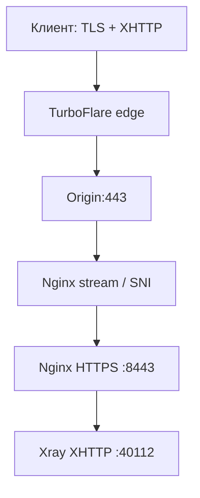

Разделение TLS:

- клиент видит доверенный публичный сертификат TurboFlare;
- TurboFlare обращается к origin по HTTPS;
- на origin используется отдельный self-signed сертификат;
- Xray принимает незашифрованный HTTP только на `127.0.0.1`, после завершения TLS в Nginx.

## Быстрый запуск

На origin-сервере:

```bash
git clone https://github.com/indie-master/Turboflare_CDN_Setup_Guide.git
cd Turboflare_CDN_Setup_Guide

cp .env.example .env
nano .env

chmod +x install.sh scripts/render.sh
sudo bash install.sh
```

Если установщик попросит добавить stream include, вставьте следующую строку **внутрь существующего** `map $ssl_preread_server_name $backend`:

```nginx
include /etc/nginx/stream-map.d/*.map;
```

После этого снова выполните:

```bash
sudo bash install.sh
```

Установщик:

1. проверяет переменные;
2. генерирует готовые конфиги;
3. создаёт self-signed origin-сертификат;
4. устанавливает отдельный Nginx vhost;
5. создаёт безопасную map-запись для существующего SNI-router;
6. сохраняет резервные копии заменяемых файлов;
7. выполняет `nginx -t` и reload.

Конфиги для панели Remnawave будут созданы в:

```text
build/<DOMAIN>/xray-inbound.json
build/<DOMAIN>/remnawave-xhttp-extra.json
build/<DOMAIN>/remnawave-host-values.md
```

Короткая шпаргалка находится в [QUICKSTART.md](QUICKSTART.md).

## Требования

- отдельный зарегистрированный домен, который можно полностью делегировать TurboFlare;
- VPS с публичным IPv4;
- Debian или Ubuntu;
- Nginx с модулем stream;
- существующая Remnawave Panel и Remnawave Node;
- Xray-core `26.7.28`;
- клиенты с поддержкой актуального XHTTP, например Incy или Throne.

TurboFlare требует делегирование доменной зоны. Обычный поддомен существующей зоны для этого сценария не подходит.

## Переменные

Создайте локальный файл, который никогда не попадёт в Git:

```bash
cp .env.example .env
nano .env
```

Основные значения:

```dotenv
DOMAIN=vpn.example.com
ORIGIN_IP=203.0.113.10
ORIGIN_PORT=443

NGINX_INTERNAL_PORT=8443
XRAY_LISTEN_IP=127.0.0.1
XRAY_XHTTP_PORT=40112
XRAY_INBOUND_TAG=xHTTP-TurboFlare
XHTTP_PATH=/static/getFile/video/segment.ts
```

| Переменная | Назначение |
|---|---|
| `DOMAIN` | Делегированный TurboFlare домен |
| `ORIGIN_IP` | Публичный IP origin-сервера |
| `ORIGIN_PORT` | Порт источника в TurboFlare, обычно `443` |
| `NGINX_INTERNAL_PORT` | Локальный HTTPS-vhost за stream router |
| `XRAY_LISTEN_IP` | Адрес Xray, оставлять `127.0.0.1` |
| `XRAY_XHTTP_PORT` | Свободный локальный порт XHTTP inbound |
| `XRAY_INBOUND_TAG` | Уникальный тег inbound в Config Profile |
| `XHTTP_PATH` | Одинаковый путь в Xray, Nginx и Host |
| `COVER_ROOT` | Каталог статического сайта-заглушки |
| `STREAM_MAP_DIR` | Каталог map-фрагментов Nginx |
| `CONFIG_PROFILE_NAME` | Название профиля для памятки Remnawave |
| `SQUAD_NAME` | Название тестового Internal Squad |

Не коммитьте `.env`. Он уже добавлен в `.gitignore`.

Чтобы только сгенерировать файлы без установки:

```bash
./scripts/render.sh
```

## Регистрация и настройка TurboFlare

Интерфейс провайдера может немного меняться, но последовательность остаётся прежней.

### 1. Создание аккаунта

1. Откройте сайт TurboFlare.
2. Зарегистрируйтесь по электронной почте и номеру телефона.
3. Подтвердите почту и телефон.
4. Задайте пароль.
5. Войдите в личный кабинет.

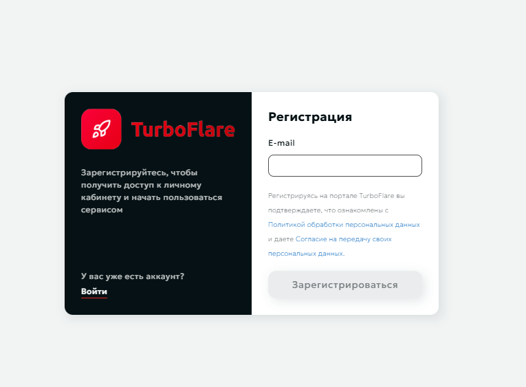

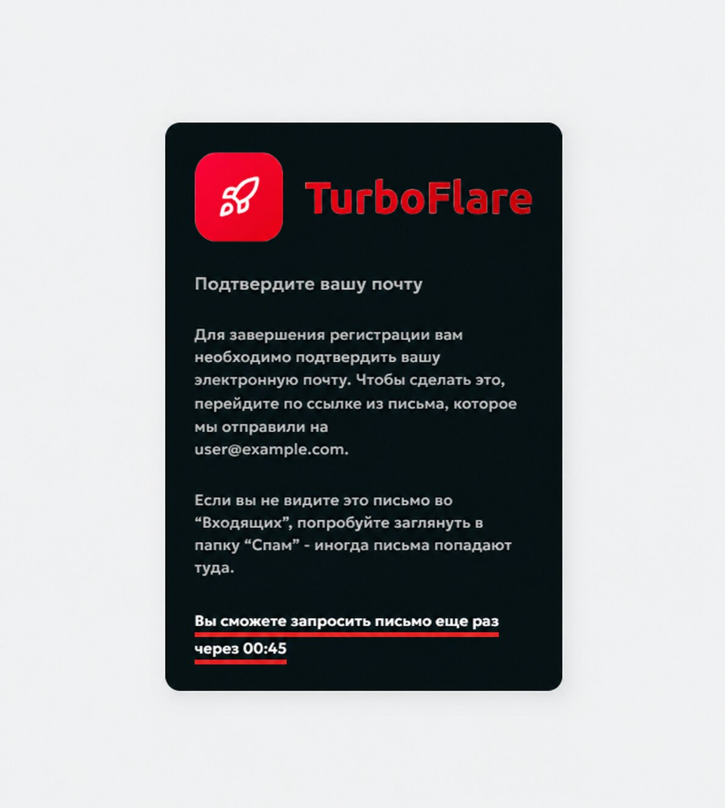

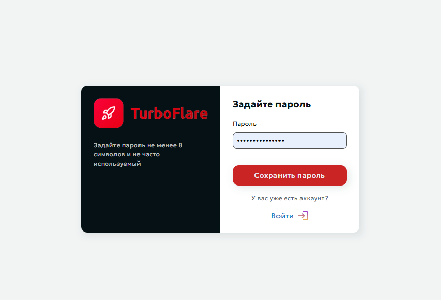

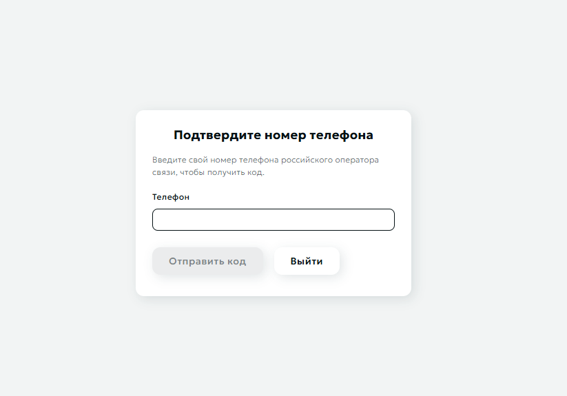

Не публикуйте в issue или скриншотах:

- телефон и электронную почту;
- идентификатор сайта;
- origin IP;
- полный список рабочих DNS-записей.

### 2. Подключение сайта

В разделе «Сайты» нажмите «Подключить новый сайт» и укажите домен из `DOMAIN`.

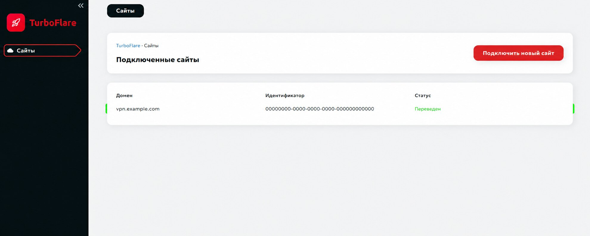

После создания TurboFlare покажет набор NS-серверов. У регистратора домена замените текущие NS на значения **из своего кабинета**.

Проверка делегирования:

```bash
dig +short NS "$DOMAIN"
```

Делегирование может занять от нескольких минут до суток. После появления статуса «Делегирована» или «Переведен» включите перевод трафика.

### 3. Настройка источника

В настройках ресурса укажите:

| Параметр | Значение |
|---|---|
| Адрес источника | `<ORIGIN_IP>:443` |
| HTTPS при запросе к источнику | включено |
| Устаревший кэш при недоступности origin | выключено |
| Учитывать query string | включено |
| Учитывать cookies | включено |

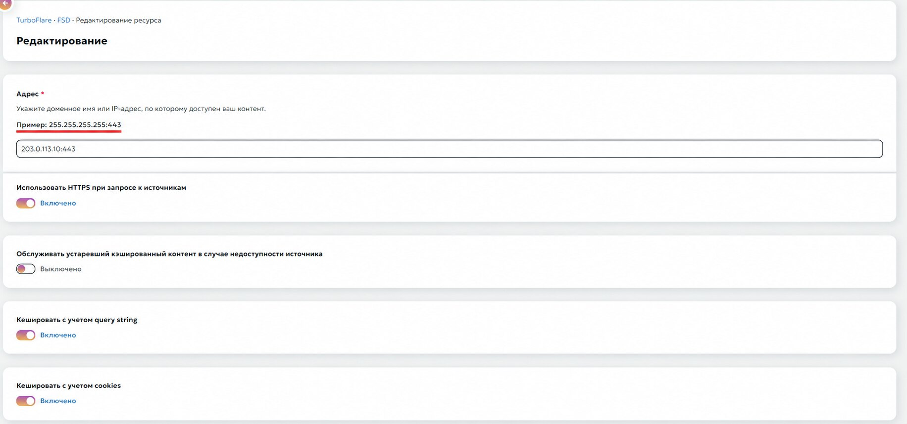

Nginx добавляет `Cache-Control: no-store` на XHTTP endpoint и отключает proxy cache. Учитывать query string и cookies полезно как дополнительная защита от смешивания сессий, потому что XHTTP передаёт session/sequence-параметры в query.

### 4. DNS-зона

Корневые A-записи CDN и `_acme-challenge` могут быть системными и заблокированными для удаления. Это нормально.

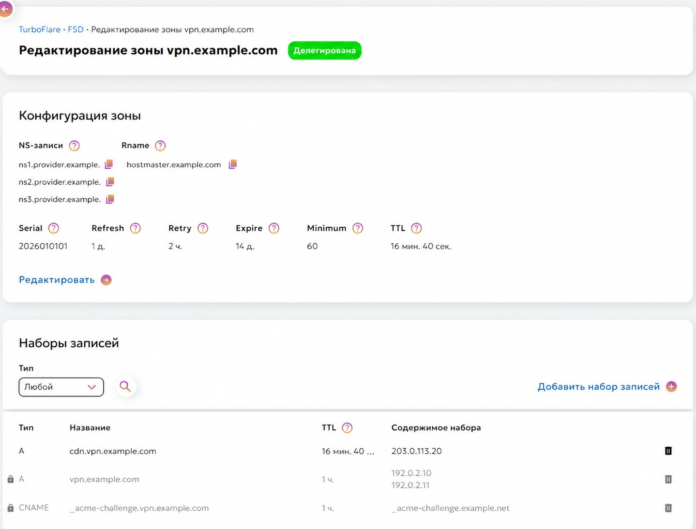

Проверьте:

```bash
dig +short NS "$DOMAIN"
dig +short A "$DOMAIN"
```

Публичный `A` должен возвращать edge IP TurboFlare, а не origin IP.

## Origin-сертификат

Для этой архитектуры не требуется выпускать Let's Encrypt сертификат на origin:

- DNS-01 мешает системный `_acme-challenge` TurboFlare;
- HTTP-01 проходит через CDN и может обрабатываться/кэшироваться edge-сервером;
- клиент всё равно получает публичный сертификат TurboFlare;
- origin-сертификат нужен только для зашифрованного CDN -> origin соединения.

`install.sh` автоматически создаёт сертификат:

```text
/etc/nginx/ssl/<DOMAIN>/origin.crt
/etc/nginx/ssl/<DOMAIN>/origin.key
```

Ручной эквивалент:

```bash
sudo install -d -m 700 /etc/nginx/ssl/vpn.example.com

sudo openssl req -x509 -nodes -newkey rsa:3072 -sha256 -days 3650 \
  -keyout /etc/nginx/ssl/vpn.example.com/origin.key \
  -out /etc/nginx/ssl/vpn.example.com/origin.crt \
  -subj "/CN=vpn.example.com" \
  -addext "subjectAltName=DNS:vpn.example.com,DNS:*.vpn.example.com" \
  -addext "basicConstraints=critical,CA:FALSE" \
  -addext "keyUsage=critical,digitalSignature,keyEncipherment" \
  -addext "extendedKeyUsage=serverAuth"
```

Проверка:

```bash
openssl x509 -in /etc/nginx/ssl/vpn.example.com/origin.crt \
  -noout -subject -issuer -dates -ext subjectAltName
```

Self-signed предупреждение при прямой проверке origin ожидаемо. Публичный запрос к TurboFlare должен проверяться без `-k`.

## Интеграция с Nginx stream

### Архитектура с существующим SNI-router

В инфраструктуре с несколькими Reality/Selfsteal/XHTTP/gRPC inbound публичный `443` уже занят одним stream server:

```nginx
server {
    listen 443 reuseport;
    proxy_pass $backend;
    ssl_preread on;
    proxy_protocol on;
    proxy_socket_keepalive on;
}
```

Не создавайте второй public `listen 443`.

Внутри существующего блока:

```nginx
map $ssl_preread_server_name $backend {
    # Существующие маршруты остаются без изменений.

    include /etc/nginx/stream-map.d/*.map;

    default 127.0.0.1:8443;
}
```

Установщик создаст файл:

```text
/etc/nginx/stream-map.d/turboflare.map
```

Его содержимое:

```nginx
vpn.example.com 127.0.0.1:8443; # TurboFlare CDN
```

Полный обезличенный пример находится в [examples/nginx-stream-block.conf](examples/nginx-stream-block.conf).

### Почему отдельный include

Установщик не должен автоматически переписывать существующий `nginx.conf`, потому что там могут находиться десятки маршрутов к другим inbound. Однократный `include` позволяет в дальнейшем разворачивать или менять TurboFlare Host без риска повредить остальную архитектуру.

### HTTP/TLS vhost

Шаблон находится в [templates/nginx-site.conf.template](templates/nginx-site.conf.template). Он:

- слушает только `127.0.0.1:8443`;
- принимает PROXY protocol от stream;
- завершает TLS с origin-сертификатом;
- проксирует только XHTTP path на Xray;
- отключает buffering/cache;
- отдаёт статическую заглушку на остальных путях.

В отличие от конфигов Certbot, шаблон не подключает:

```nginx
include /etc/letsencrypt/options-ssl-nginx.conf;
ssl_dhparam /etc/letsencrypt/ssl-dhparams.pem;
```

Это позволяет развернуть origin на чистом сервере без Certbot.

Проверка:

```bash
sudo nginx -t
sudo systemctl reload nginx

ss -lntp | grep -E ':443|:8443|:40112'
```

## Настройка Xray в Remnawave

### 1. Версия ядра

Установите или выберите Xray-core `26.7.28`. Именно с этой версией проверен набор используемых XHTTP-полей.

### 2. Config Profile

Откройте Config Profile, который назначен нужной ноде, и добавьте объект из:

```text
build/<DOMAIN>/xray-inbound.json
```

Готовый шаблон: [templates/xray-inbound.json.template](templates/xray-inbound.json.template).

Ключевые параметры:

```json
{
  "tag": "xHTTP-TurboFlare",
  "port": 40112,
  "listen": "127.0.0.1",
  "protocol": "vless",
  "settings": {
    "clients": [],
    "decryption": "none"
  },
  "streamSettings": {
    "network": "xhttp",
    "security": "none"
  }
}
```

`security: none` здесь правильно: TLS уже завершён в Nginx.

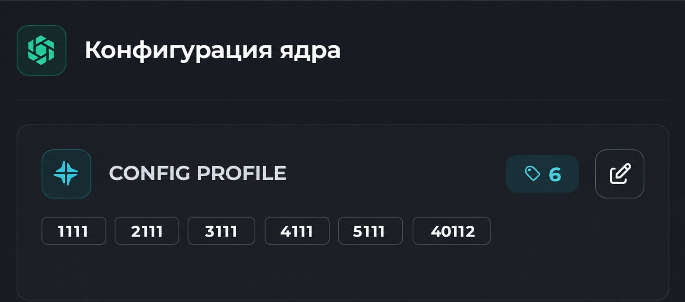

### 3. Правильные XHTTP-поля

В Xray `26.7.28` используются:

```json
"sessionIDKey": "auth",
"sessionIDPlacement": "query"
```

Не используйте устаревшие/ошибочные варианты `sessionKey` и `sessionPlacement`.

### 4. X-Forwarded-For

Рабочая конфигурация:

```json
"sockopt": {
  "trustedXForwardedFor": [
    "X-Real-IP",
    "X-Forwarded-For"
  ]
}
```

Это именно названия доверенных HTTP-заголовков. Xray принимает адрес из `X-Forwarded-For`, только если присутствует один из перечисленных trusted headers. Nginx устанавливает оба заголовка и является единственным локальным источником трафика на `127.0.0.1:40112`.

### 5. Routing

Если в `routing.rules` уже есть правила с явным `inboundTag`, добавьте новый тег в подходящее правило:

```json
{
  "type": "field",
  "inboundTag": [
    "ANOTHER-CDN-INBOUND",
    "xHTTP-TurboFlare"
  ],
  "outboundTag": "YOUR-OUTBOUND"
}
```

Не копируйте чужой `outboundTag`: используйте существующий маршрут своей ноды. Если inbound-теги нигде явно не перечисляются, отдельное правило может не понадобиться.

Сохраните Config Profile и примените изменения. После запуска:

```bash
ss -lntp | grep ':40112'
```

Ожидается listener на `127.0.0.1:40112`.

Логи Remnawave Node:

```bash
cd /opt/remnanode
docker compose logs --since=15m remnanode \
  | grep -aEi 'xHTTP-TurboFlare|40112|error|failed'
```

`grep -a` нужен потому, что Docker log может определяться как бинарный поток.

## Настройка Remnawave Node

Откройте нужную ноду и выберите Config Profile, в который был добавлен `xHTTP-TurboFlare`.


После сохранения дождитесь статуса Node Online. При необходимости выполните однократный Force Restart Xray.

Допустимое первое сообщение в журнале:

```text
Inbound xHTTP-TurboFlare not found in inboundsHashMap, creating new one
```

Это регистрация нового inbound во внутренней карте Remnawave, а не ошибка Xray.

## Создание Internal Squad

Для безопасного теста не публикуйте новый Host сразу всем пользователям.

1. Создайте Internal Squad с именем `TurboFlare-Test`.
2. Откройте выбор профилей/inbound.
3. В нужном Config Profile отметьте только `xHTTP-TurboFlare`.
4. Добавьте одного тестового пользователя.
5. После проверки расширьте аудиторию.

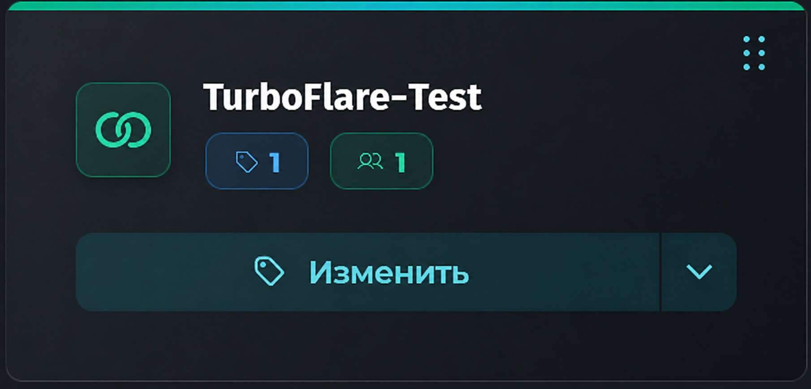

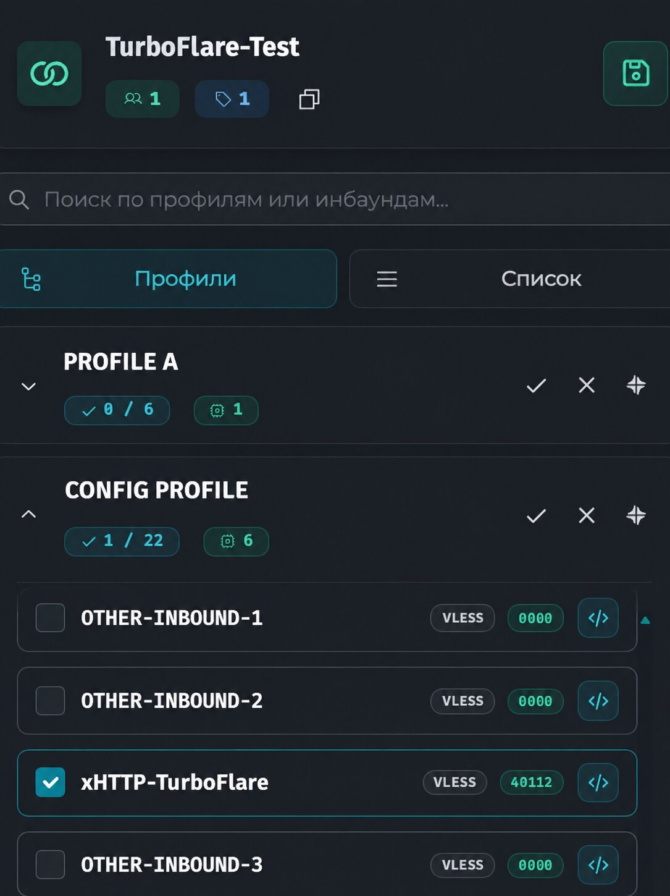

## Создание Host

Создайте новый Host и включите его видимость.

### Основные параметры

| Поле | Значение |
|---|---|
| Remark | `TurboFlare CDN` |
| Config Profile | профиль с новым inbound |
| Inbound | `xHTTP-TurboFlare` |
| Address | значение `DOMAIN` |
| Port | `443` |

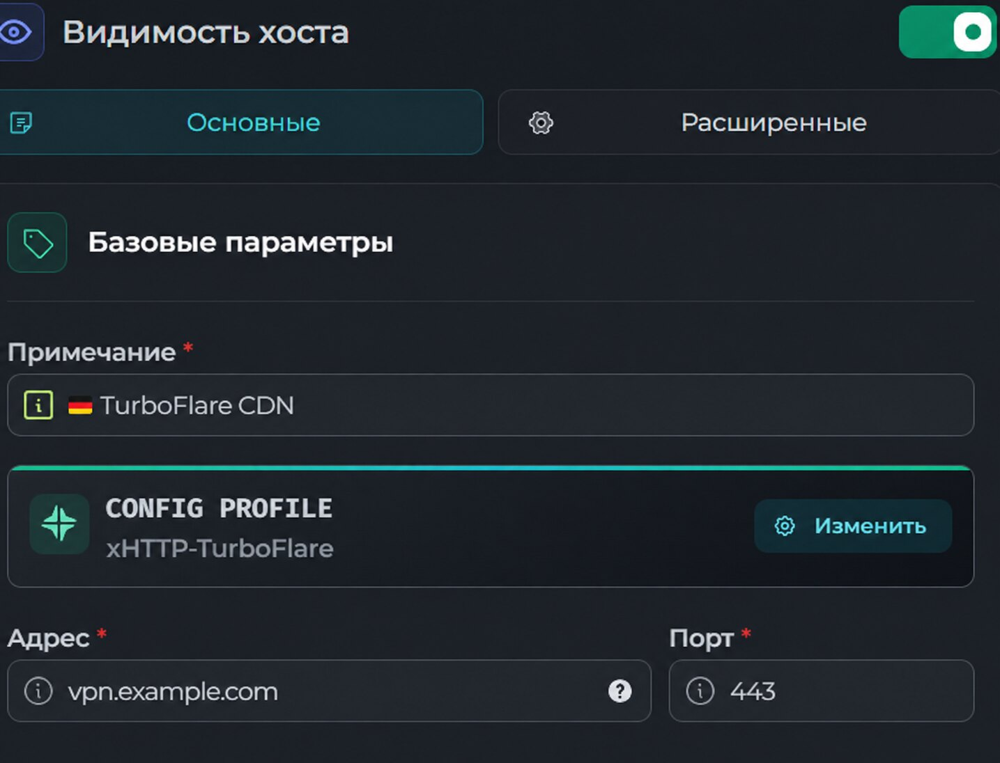

### Расширенные параметры

| Поле | Значение |
|---|---|
| SNI | значение `DOMAIN` |
| Переопределить SNI из адреса | выключено |
| Оставить SNI пустым | выключено |
| Host | значение `DOMAIN` |
| Path | значение `XHTTP_PATH` |
| Security Layer | `TLS` |
| ALPN | `h2` |
| Fingerprint | `firefox` |
| Allow insecure | выключено |
| Flow | пусто |
| Mode | `packet-up`, если поле присутствует |

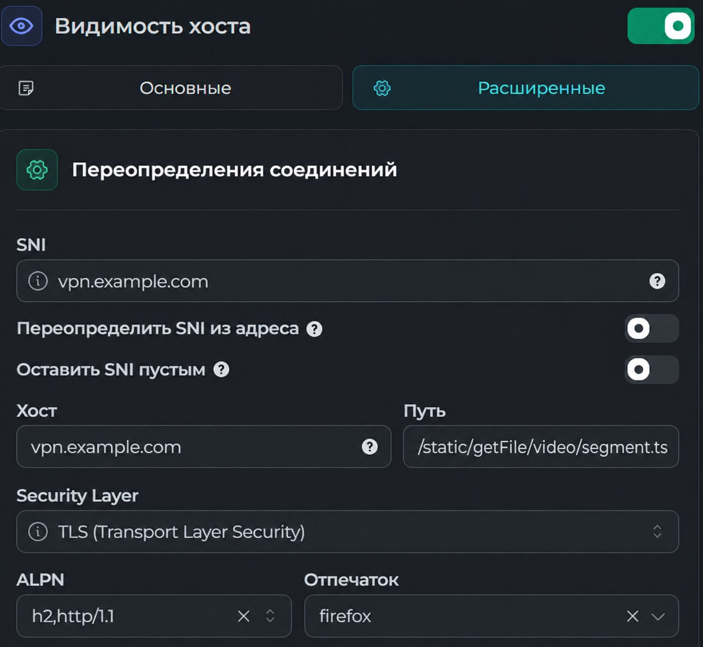

Host использует `TLS`, хотя серверный Xray inbound использует `security: none`: клиентский TLS заканчивается на Nginx/TurboFlare, а не внутри Xray.

### XHTTP Extra

Вставьте содержимое:

```text
build/<DOMAIN>/remnawave-xhttp-extra.json
```

Исходный шаблон: [templates/remnawave-xhttp-extra.json.template](templates/remnawave-xhttp-extra.json.template).

```json
{
  "xmux": {
    "maxConcurrency": "4-8",
    "hKeepAlivePeriod": 0,
    "hMaxRequestTimes": "600-900",
    "hMaxReusableSecs": "120-180"
  },
  "seqKey": "chunk_id",
  "noSSEHeader": true,
  "noGRPCHeader": true,
  "seqPlacement": "query",
  "sessionIDKey": "auth",
  "xPaddingBytes": "50-150",
  "xPaddingMethod": "tokenish",
  "sessionIDLength": "16-32",
  "xPaddingObfsMode": true,
  "xPaddingPlacement": "header",
  "scMaxEachPostBytes": "256000-512000",
  "sessionIDPlacement": "query",
  "scMinPostsIntervalMs": "30-50"
}
```

Это профиль с пониженным пиковым расходом памяти и ротацией старых H2-соединений, рассчитанный в первую очередь на iOS-клиенты. Сервер принимает POST до `1000000` байт, а клиент отправляет меньшие блоки `256000-512000` байт. Значение `hKeepAlivePeriod: 0` не отключает keepalive: Xray использует стандартный H2-интервал, близкий к Chrome. Полное объяснение и сценарий проверки: [docs/IOS-STABILITY.md](docs/IOS-STABILITY.md).

## Проверка

### 1. Listener

```bash
ss -lntp | grep -E ':443|:8443|:40112'
```

Ожидается:

- public Nginx stream на `0.0.0.0:443`;
- Nginx vhost на `127.0.0.1:8443`;
- Xray на `127.0.0.1:40112`.

### 2. Прямой origin

```bash
curl -4vk \
  --resolve vpn.example.com:443:203.0.113.10 \
  https://vpn.example.com/
```

Замените демонстрационные значения на свои. Ожидается загрузка cover page. Предупреждение self-signed ожидаемо.

### 3. Через TurboFlare

```bash
curl -4v https://vpn.example.com/
```

Ожидается:

- сертификат успешно проверяется без `-k`;
- загружается та же cover page;
- присутствуют CDN-заголовки наподобие `X-CDN-Edge-Id` и `X-CDN-Request-Id`.

### 4. XHTTP endpoint

```bash
curl -4vk --http2 --max-time 8 \
  'https://vpn.example.com/static/getFile/video/segment.ts?auth=0123456789abcdef&chunk_id=0'
```

Это не полноценный VLESS-запрос, поэтому допустимы HTTP 400, закрытие соединения или таймаут. Недопустимы:

- `502 Bad Gateway`;
- `413 Request Entity Too Large`;
- главная cover page вместо XHTTP-ответа.

### 5. Клиент

1. Назначьте тестового пользователя в `TurboFlare-Test`.
2. Обновите подписку в Incy или Throne.
3. Выберите Host `TurboFlare CDN`.
4. Подключитесь и проверьте сайты/внешний IP.
5. Следите за Nginx и Remnawave logs.

```bash
tail -f /var/log/nginx/vpn.example.com.access.log
```

Старые версии sing-box, включая распространённую связку Podkop + sing-box `1.12.22`, могут не поддерживать этот XHTTP-профиль. Оставьте для таких устройств отдельные совместимые Hosts.

## Диагностика

Расширенная таблица: [docs/TROUBLESHOOTING.md](docs/TROUBLESHOOTING.md).

| Симптом | Проверка |
|---|---|
| Direct origin не работает | `nginx -t`, `ss`, stream map, firewall |
| Direct origin работает, CDN нет | origin IP/port/HTTPS и статус делегирования |
| `502` на XHTTP path | listener `127.0.0.1:40112` и Config Profile |
| `413` | `client_max_body_size 4m` |
| Host отсутствует в подписке | Host visibility, Config Profile, inbound, Internal Squad |
| TLS error у клиента | Address/SNI/Host должны совпадать с `DOMAIN`, insecure выключен |
| Соединение есть, трафика нет | routing rule и outbound tag |

## Безопасность

- Не публикуйте `.env`.
- Не открывайте `40112` в firewall: Xray должен слушать только loopback.
- Храните `/etc/nginx/ssl/<DOMAIN>/origin.key` с правами `600`.
- Не публикуйте скриншоты с origin IP, UUID сайта, рабочими доменами, пользователями и названиями нод.
- Не создавайте второй public `listen 443` при существующем stream router.
- Не включайте `Allow insecure` в Remnawave Host.
- Не используйте TLS 1.0/1.1 в HTTP vhost; шаблон включает только TLS 1.2/1.3.
- Перед изменением существующего Nginx сохраняйте резервную копию.

Все скриншоты в этом репозитории используют только демонстрационные данные.

## Обновление и откат

Установщик сохраняет предыдущие версии файлов с суффиксом:

```text
.bak-YYYYMMDD-HHMMSS
```

Для отката восстановите нужный файл и выполните:

```bash
sudo nginx -t && sudo systemctl reload nginx
```

В Remnawave:

1. выключите Host;
2. уберите тестового пользователя из Squad;
3. удаляйте inbound из Config Profile только после переключения пользователей.

## Источники

- Исходное руководство TurboFlare: <https://github.com/Artem-fix/Turboflare_CDN_Setup_Guide>
- Поля XHTTP Xray-core: <https://github.com/XTLS/Xray-core/blob/c1958dba04ba065cd82a05b65bfe877e2323f0cc/infra/conf/transport_method.go>
- Обработка `trustedXForwardedFor`: <https://github.com/XTLS/Xray-core/blob/c1958dba04ba065cd82a05b65bfe877e2323f0cc/common/protocol/http/headers.go>

## Примечание

Используйте конфигурацию только в рамках применимого законодательства и правил поставщика услуг.
